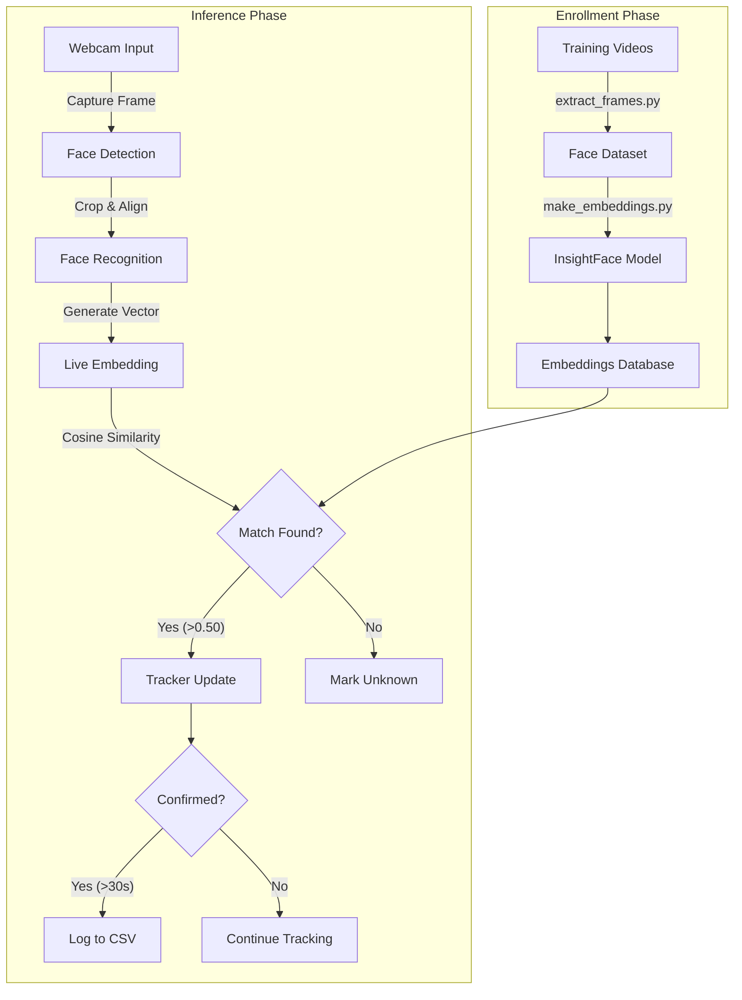
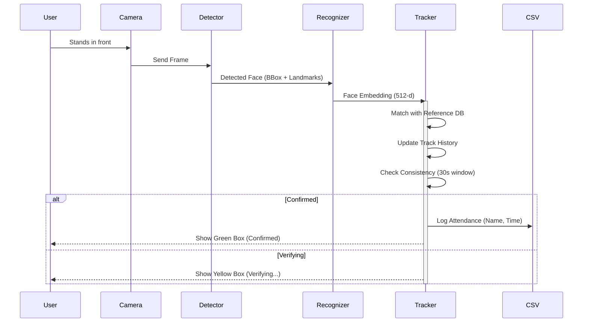
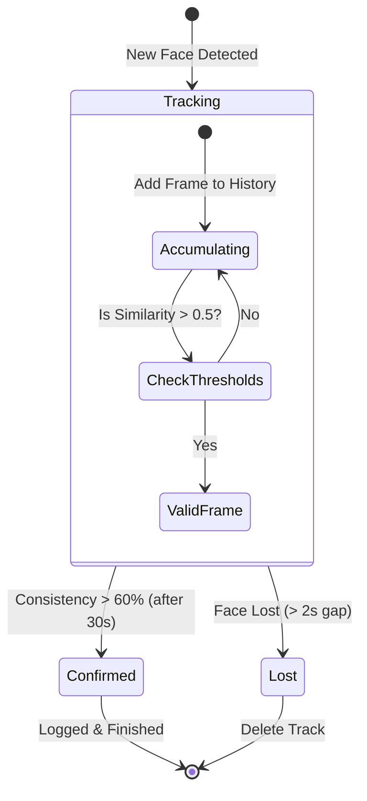
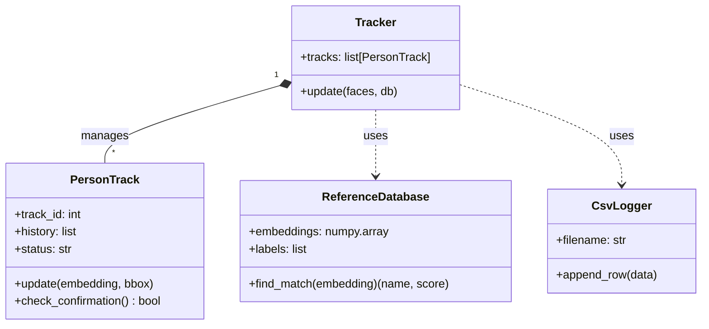

# Graphical Representations

This document contains visual diagrams of the Face Recognition Attendance System's architecture and logic. You can use these in your project report.

## 1. System Architecture (Data Flow)

This flowchart illustrates how data moves through the system, from video input to the final CSV log.

## 2. Sequence Diagram (Runtime Logic)

This diagram shows the step-by-step interaction between the User, the Camera, and the System components during a single frame processing loop.

## 3. State Machine (Person Tracking)

This diagram represents the lifecycle of a tracked person ("PersonTrack" object).

## 4. Class Diagram

This shows the structure of the Python classes used in `infer_and_log.py`.

