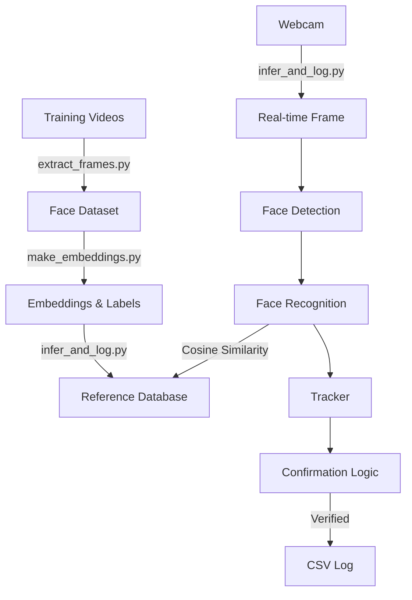

# Face Recognition Attendance System - Project Documentation

This document provides a deep dive into the architecture, logic, and configuration of the Face Recognition Attendance System.

## 1. System Architecture

The system operates in a pipeline: **Video Input -> Frame Extraction -> Embedding Generation -> Real-time Inference**.



## 2. Component Analysis

### A. Frame Extraction (`extract_frames.py`)
- **Purpose**: Converts raw video footage into a clean dataset of face images.
- **Logic**:
    - Iterates through `videos/*.mp4`.
    - Samples every **5th frame** to avoid redundancy.
    - Uses `insightface` (detection mode) to find faces.
    - **Alignment**: Uses facial keypoints (kps) to perform `norm_crop`, ensuring eyes are horizontally aligned.
    - **Output**: Saves aligned 112x112 (or similar) face chips to `dataset/{Name_USN}/`.

### B. Embedding Generation (`make_embeddings.py`)
- **Purpose**: Pre-calculates feature vectors for all enrolled users.
- **Logic**:
    - Loads images from `dataset/`.
    - Uses `insightface` (recognition mode) to generate a 512-dimensional embedding for each face.
    - **Normalization**: Normalizes vectors so their length (L2 norm) is 1.0. This allows Dot Product to be used as Cosine Similarity.
    - **Output**: Saves `embeddings.npy` (vectors) and `labels.npy` (names).

### C. Classifier Training (`train_classifier.py`)
- **Purpose**: Trains an SVM classifier (Optional/Legacy).
- **Note**: The current real-time inference script (`infer_and_log.py`) uses **Cosine Similarity** directly against the embeddings, *not* this SVM model. This script is provided for experimental purposes or if you wish to switch to a classification-based approach.

### D. Real-time Inference (`infer_and_log.py`)
This is the core engine. It combines detection, tracking, and identity verification.

#### Key Classes:
1.  **`ReferenceDatabase`**:
    - Loads `embeddings.npy`.
    - Performs **Nearest Neighbor Search** using dot product (Cosine Similarity).
    - Returns the best match and similarity score.

2.  **`Tracker`**:
    - Uses the **Hungarian Algorithm** to track faces across frames.
    - Assigns a unique ID to each face.
    - Handles temporary occlusions (keeps track alive for `MAX_GAP_SECONDS`).

3.  **`PersonTrack` (The "Brain")**:
    - Maintains a history of a specific person's face track.
    - **Confirmation Logic**:
        - **Window**: Analyzes the last 30 seconds of history.
        - **Consistency**: The same identity must be the top match in **60%** of valid frames.
        - **Thresholds**: Similarity > 0.50, Confidence > 0.70.
    - Once confirmed, it logs to CSV and locks the identity.

## 3. Configuration & Tuning

All settings are in `scripts/infer_and_log.py`.

### Identity Mapping
**CRITICAL**: You must manually update the `ENROLLED_PEOPLE` dictionary to map names to Login IDs.
```python
ENROLLED_PEOPLE = {
    "shafiq": "4SN23AD001",
    "sudit": "4SN23AD00051",
    # Add new people here: "name": "ID"
}
```
*The keys must match the folder names in `dataset/` (case-insensitive).*

### Thresholds
| Constant | Default | Description |
| :--- | :--- | :--- |
| `MIN_FACE_CONF` | 0.70 | Minimum quality score for a face to be considered. |
| `SIMILARITY_THRESH` | 0.50 | Minimum similarity (0-1) to match a known person. Increase to 0.6+ for stricter security. |
| `WINDOW_SECONDS` | 30.0 | How long a face must be tracked before confirmation. |
| `REQUIRED_CONSISTENCY`| 0.60 | % of frames that must match the same person. |

## 4. Troubleshooting

### "Unknown" Results
- **Cause**: The face similarity is below `SIMILARITY_THRESH` (0.50).
- **Fix**:
    - Ensure the training video had good lighting.
    - The person might be too far from the camera.
    - Lower `SIMILARITY_THRESH` slightly (e.g., 0.45) - *Warning: Increases false positives.*

### "GPU initialization failed"
- **Cause**: CUDA drivers not found or `onnxruntime-gpu` not installed.
- **Fix**: The script automatically falls back to CPU. This is normal and safe, just slower.

### CSV Not Updating
- **Cause**: The person hasn't been "Confirmed" yet.
- **Fix**: Watch the on-screen text. It must turn **Green** ("Confirmed") to log. If it stays Yellow ("Verifying"), the consistency check hasn't passed.

## 5. File Structure Reference
- `dataset/`: Generated by step 1. Do not edit manually.
- `embeddings.npy`: The "database". Delete this and run `make_embeddings.py` to reset.
- `detections.csv`: The output log. Can be opened in Excel.
